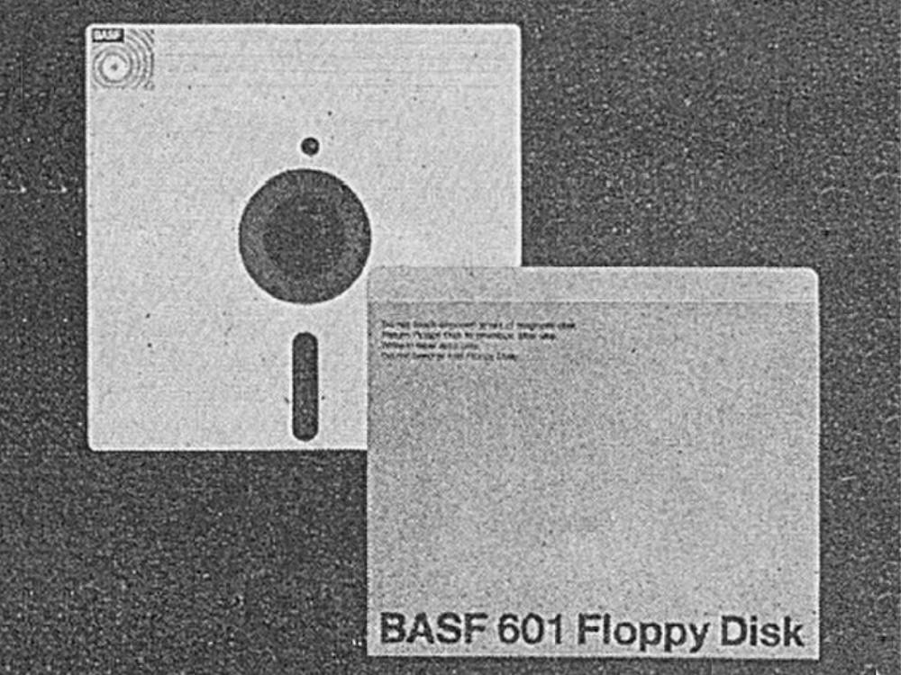
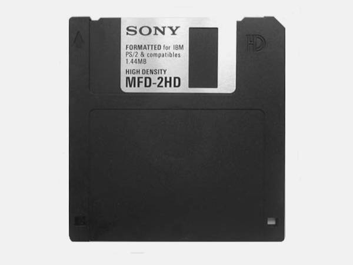

Back in the 1980s, there was a vibrant community of nerds who fiddled with archaic programming languages to create animations and visuals. Is this culture experiencing a renaissance of sorts with Creative Coding? Why even bother learning programming to create motion graphics when it's so much easier with modern motion design software?

